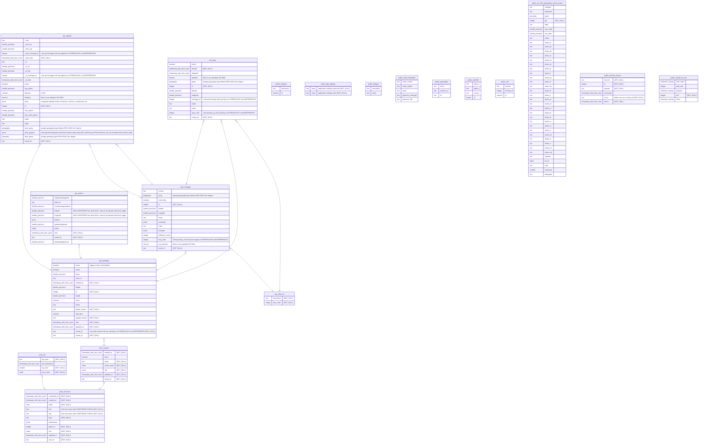

```mermaid
erDiagram
    api_logbook {
        text _from
        double_precision _from_lat
        double_precision _from_lng
        integer _from_moorage_id "Link api.moorages with api.logbook via FOREIGN KEY and REFERENCES"
        timestamp_with_time_zone _from_time "{NOT_NULL}"
        text _to
        double_precision _to_lat
        double_precision _to_lng
        integer _to_moorage_id "Link api.moorages with api.logbook via FOREIGN KEY and REFERENCES"
        timestamp_with_time_zone _to_time
        boolean active
        double_precision avg_speed
        numeric distance "in NM"
        interval duration "Best to use standard ISO 8601"
        jsonb extra "computed signalk metrics of interest, runTime, currentLevel, etc"
        integer id "{NOT_NULL}"
        double_precision max_speed
        double_precision max_wind_speed
        text name
        text notes
        geography track_geog "postgis geography type default SRID 4326 Unit: degres"
        jsonb track_geojson "store generated geojson with track metrics data using with LineString and Point features, we can not depend api.metrics table"
        geometry track_geom "postgis geometry type EPSG:4326 Unit: degres"
        text vessel_id "{NOT_NULL}"
    }

    api_metadata {
        boolean active "trigger monitor online/offline"
        boolean active
        double_precision beam
        text client_id
        timestamp_with_time_zone created_at "{NOT_NULL}"
        double_precision height
        integer id "{NOT_NULL}"
        double_precision length
        numeric mmsi
        text name
        text plugin_version "{NOT_NULL}"
        numeric ship_type
        text signalk_version "{NOT_NULL}"
        timestamp_with_time_zone time "{NOT_NULL}"
        timestamp_with_time_zone updated_at "{NOT_NULL}"
        text vessel_id "Link auth.vessels with api.metadata via FOREIGN KEY and REFERENCES {NOT_NULL}"
        text vessel_id "{NOT_NULL}"
    }

    api_metrics {
        double_precision anglespeedapparent
        text client_id
        double_precision courseovergroundtrue
        double_precision latitude "With CONSTRAINT but allow NULL value to be ignored silently by trigger"
        double_precision longitude "With CONSTRAINT but allow NULL value to be ignored silently by trigger"
        jsonb metrics
        double_precision speedoverground
        status status "<sailing,motoring,moored,anchored>"
        timestamp_with_time_zone time "{NOT_NULL}"
        text vessel_id "{NOT_NULL}"
        double_precision windspeedapparent
    }

    api_moorages {
        text country
        geography geog "postgis geography type default SRID 4326 Unit: degres"
        boolean home_flag
        integer id "{NOT_NULL}"
        double_precision latitude
        double_precision longitude
        text name
        jsonb nominatim
        text notes
        jsonb overpass
        integer reference_count
        integer stay_code "Link api.stays_at with api.moorages via FOREIGN KEY and REFERENCES"
        interval stay_duration "Best to use standard ISO 8601"
        text vessel_id "{NOT_NULL}"
    }

    api_stays {
        boolean active
        timestamp_with_time_zone arrived "{NOT_NULL}"
        timestamp_with_time_zone departed
        interval duration "Best to use standard ISO 8601"
        geography geog "postgis geography type default SRID 4326 Unit: degres"
        integer id "{NOT_NULL}"
        double_precision latitude
        double_precision longitude
        integer moorage_id "Link api.moorages with api.stays via FOREIGN KEY and REFERENCES"
        text name
        text notes
        integer stay_code "Link api.stays_at with api.stays via FOREIGN KEY and REFERENCES"
        text vessel_id "{NOT_NULL}"
    }

    api_stays_at {
        text description "{NOT_NULL}"
        integer stay_code "{NOT_NULL}"
    }

    auth_accounts {
        timestamp_with_time_zone connected_at "{NOT_NULL}"
        timestamp_with_time_zone created_at "{NOT_NULL}"
        citext email "{NOT_NULL}"
        text first "User first name with CONSTRAINT CHECK {NOT_NULL}"
        text last "User last name with CONSTRAINT CHECK {NOT_NULL}"
        text pass "{NOT_NULL}"
        jsonb preferences
        integer public_id "{NOT_NULL}"
        name role "{NOT_NULL}"
        timestamp_with_time_zone updated_at "{NOT_NULL}"
        text user_id "{NOT_NULL}"
    }

    auth_otp {
        text otp_pass "{NOT_NULL}"
        timestamp_with_time_zone otp_timestamp
        smallint otp_tries "{NOT_NULL}"
        citext user_email "{NOT_NULL}"
    }

    auth_vessels {
        timestamp_with_time_zone created_at "{NOT_NULL}"
        numeric mmsi
        text name "{NOT_NULL}"
        citext owner_email "{NOT_NULL}"
        name role "{NOT_NULL}"
        timestamp_with_time_zone updated_at "{NOT_NULL}"
        text vessel_id "{NOT_NULL}"
    }

    public_aistypes {
        text description
        numeric id
    }

    public_app_settings {
        text name "application settings name key {NOT_NULL}"
        text value "application settings value {NOT_NULL}"
    }

    public_badges {
        text description
        text name
    }

    public_email_templates {
        text email_content
        text email_subject
        text name
        text pushover_message
        text pushover_title
    }

    public_geocoders {
        text name
        text reverse_url
        text url
    }

    public_iso3166 {
        text alpha_2
        text alpha_3
        text country
        integer id
    }

    public_mid {
        text country
        integer country_id
        numeric id
    }

    public_ne_10m_geography_marine_polys {
        text changed
        text featurecla
        geometry geom
        integer gid "{NOT_NULL}"
        text label
        double_precision max_label
        double_precision min_label
        text name
        text name_ar
        text name_bn
        text name_de
        text name_el
        text name_en
        text name_es
        text name_fa
        text name_fr
        text name_he
        text name_hi
        text name_hu
        text name_id
        text name_it
        text name_ja
        text name_ko
        text name_nl
        text name_pl
        text name_pt
        text name_ru
        text name_sv
        text name_tr
        text name_uk
        text name_ur
        text name_vi
        text name_zh
        text name_zht
        text namealt
        bigint ne_id
        text note
        smallint scalerank
        text wikidataid
    }

    public_process_queue {
        text channel "{NOT_NULL}"
        integer id "{NOT_NULL}"
        text payload "{NOT_NULL}"
        timestamp_with_time_zone processed
        text ref_id "either user_id or vessel_id {NOT_NULL}"
        timestamp_with_time_zone stored "{NOT_NULL}"
    }

    public_spatial_ref_sys {
        character_varying auth_name
        integer auth_srid
        character_varying proj4text
        integer srid "{NOT_NULL}"
        character_varying srtext
    }

    api_logbook }o--|| api_metadata : ""
    api_logbook }o--|| api_moorages : ""
    api_logbook }o--|| api_moorages : ""
    api_metadata }o--|| auth_vessels : ""
    api_metrics }o--|| api_metadata : ""
    api_moorages }o--|| api_metadata : ""
    api_stays }o--|| api_metadata : ""
    api_moorages }o--|| api_stays_at : ""
    api_stays }o--|| api_moorages : ""
    api_stays }o--|| api_stays_at : ""
    auth_otp |o--|| auth_accounts : ""
    auth_vessels |o--|| auth_accounts : ""
```