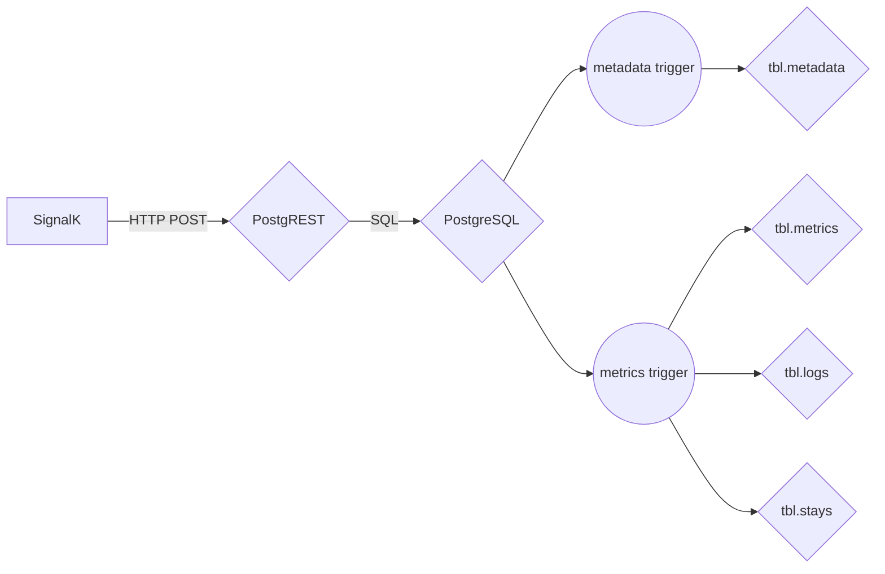
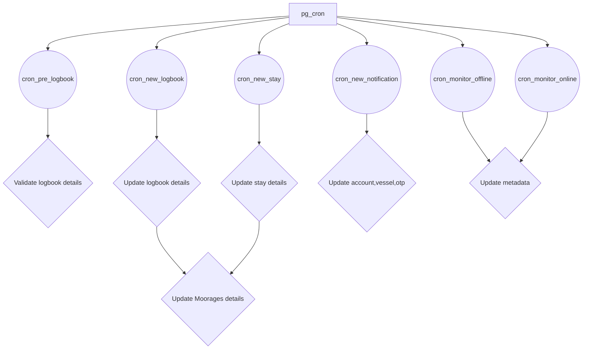

# PostgSail ERD
The Entity-Relationship Diagram (ERD) provides a graphical representation of database tables, columns, and inter-relationships. ERD can give sufficient information for the database administrator to follow when developing and maintaining the database.

## A global overview
Auto generated Mermaid diagram using [mermerd](https://github.com/KarnerTh/mermerd) and [MermaidJs](https://github.com/mermaid-js/mermaid).

[PostgSail SQL Schema](https://github.com/xbgmsharp/postgsail/tree/main/docs/ERD/postgsail.md "PostgSail SQL Schema")

## Further
There is 3 main schemas:
- API Schema:
  - tables
    - metrics
    - logbook
    - ...
  - functions
    - ...

- Auth Schema:
  - tables
    - accounts
    - vessels
    - ...
  - functions
    - ...

- Public Schema:
  - tables
    - app_settings
    - tpl_messages
    - ...
  - functions
    - ...

## Overview
- Insert data into table metadata from API using PostgREST
- Insert data into table metrics from API using PostgREST
- TimescaleDB Hypertable to store signalk metrics
- pgsql functions to generate logbook, stays, moorages
- CRON functions to process logbook, stays, moorages
- python functions for geo reverse and send notification via email and/or pushover
- Views statistics, timelapse, monitoring, logs
- Always store time in UTC

## Ingest flowchart

## pg_cron flowchart
