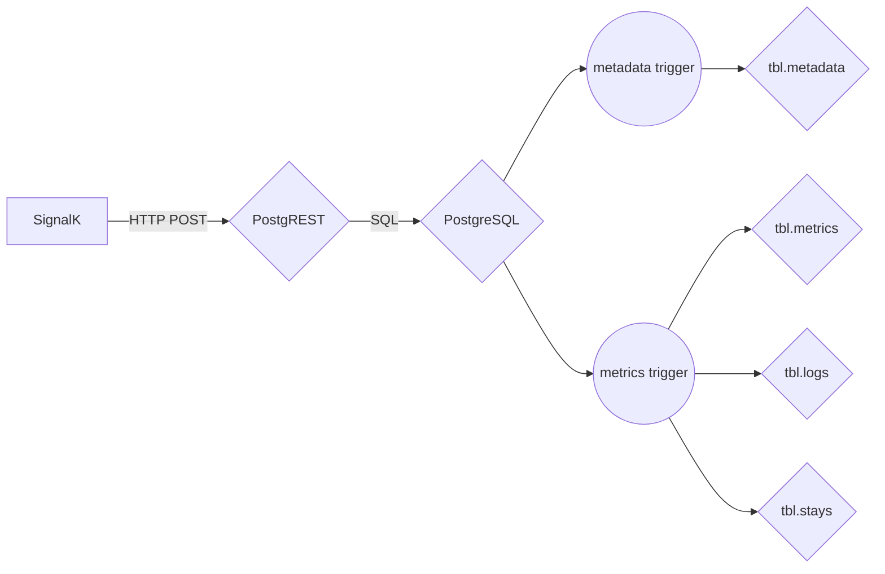
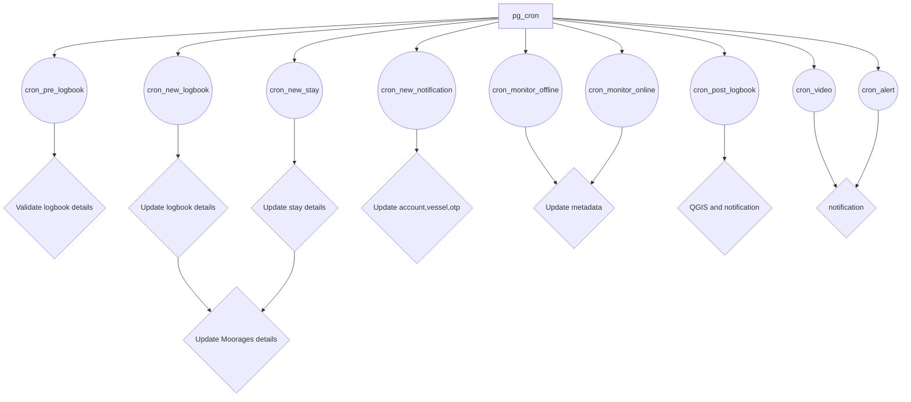

# PostgSail ERD
The Entity-Relationship Diagram (ERD) provides a graphical representation of database tables, columns, and inter-relationships. ERD can give sufficient information for the database administrator to follow when developing and maintaining the database.

## A global overview
Auto generated Mermaid diagram using [mermerd](https://github.com/KarnerTh/mermerd) and [MermaidJs](https://github.com/mermaid-js/mermaid).

[PostgSail SQL Schema](https://github.com/xbgmsharp/postgsail/tree/main/docs/ERD/postgsail.md "PostgSail SQL Schema")

## Further
There is 3 main schemas into the signalk database:
- API Schema:
  - tables
    - metrics
    - logbook
    - ...
  - functions
    - ...

- Auth Schema:
  - tables
    - accounts
    - vessels
    - ...
  - functions
    - ...

- Public Schema:
  - tables
    - app_settings
    - tpl_messages
    - ...
  - functions
    - ...

## Overview
- Insert data into table metadata from API using PostgREST
- Insert data into table metrics from API using PostgREST
- TimescaleDB Hypertable to store signalk metrics
- pgsql functions to generate logbook, stays, moorages
- CRON functions to process logbook, stays, moorages
- python functions for geo reverse and send notification via email and/or pushover
- Views statistics, timelapse, monitoring, logs
- Always store time in UTC

## Ingest flowchart


## pg_cron flowchart

cron job are not process by default because if you don't have the correct settings set (SMTP, PushOver, Telegram), you might enter in a loop with error and you could be blocked or banned from the external services.

Therefor by default they are no active job as it require external configuration settings (SMTP, PushOver, Telegram).
To activate all cron.job run the following SQL command:
```sql
UPDATE cron.job SET active = True;
```
Be sure to review your postgsail settings via SQL in the table `app_settings`:
```sql
SELECT * FROM public.app_settings;
```

### How to bypass OTP for a local install?

To can skip the otp process, add or update the following json key value to the account preference.
```json
"email_valid": true
```
SQL query
```sql
UPDATE auth.accounts
	SET preferences='{"email_valid": true}'::jsonb || preferences
	WHERE email='your.email@domain.com';
```

OTP is created and sent by email using a cron in postgres/cron/job.
```sql
SELECT * FROM auth.otp;
```

Accounts are store in table signalk/auth/accounts
```sql
SELECT * FROM auth.accounts;
```

You should have an history in table signalk/public/process_queue
```sql
SELECT * from public.process_queue;
```

### How to turn off signups

If you just want to use this as a standalone application and don't want people to be able to sign up for an account.

```SQL
revoke execute on function api.signup(text,text,text,text) to api_anonymous;
```
