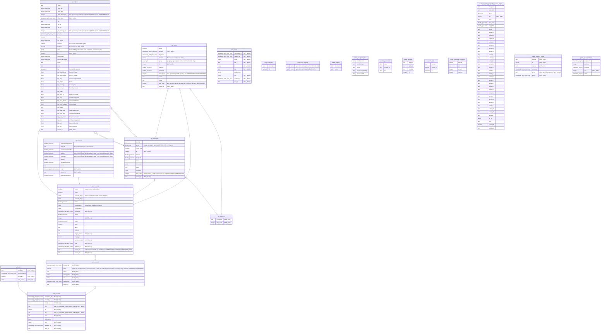

```mermaid
erDiagram
    api_logbook {
        text _from 
        double_precision _from_lat 
        double_precision _from_lng 
        integer _from_moorage_id "Link api.moorages with api.logbook via FOREIGN KEY and REFERENCES"
        timestamp_with_time_zone _from_time "{NOT_NULL}"
        text _to 
        double_precision _to_lat 
        double_precision _to_lng 
        integer _to_moorage_id "Link api.moorages with api.logbook via FOREIGN KEY and REFERENCES"
        timestamp_with_time_zone _to_time 
        boolean active 
        double_precision avg_speed 
        numeric distance "Distance in nautical miles (NM)"
        interval duration "Duration in ISO 8601 format"
        jsonb extra "Computed SignalK metrics such as runtime, current level, etc."
        integer id "{NOT_NULL}"
        double_precision max_speed 
        double_precision max_wind_speed 
        text name 
        text notes 
        tgeogpoint trip "MobilityDB trajectory"
        tfloat trip_batt_charge "Battery Charge"
        tfloat trip_batt_voltage "Battery Voltage"
        tfloat trip_cog "courseovergroundtrue"
        tfloat trip_depth "Depth"
        tfloat trip_heading "heading True"
        tfloat trip_hum_out "Humidity outside"
        ttext trip_notes 
        tfloat trip_pres_out "Pressure outside"
        tfloat trip_sog "speedoverground"
        tfloat trip_solar_power "solar powerPanel"
        tfloat trip_solar_voltage "solar voltage"
        ttext trip_status 
        tfloat trip_tank_level "Tank currentLevel"
        tfloat trip_temp_out "Temperature outside"
        tfloat trip_temp_water "Temperature water"
        tfloat trip_twa "windspeedapparent"
        tfloat trip_twd "truewinddirection"
        tfloat trip_tws "truewindspeed"
        text vessel_id "{NOT_NULL}"
    }

    api_metadata {
        boolean active "trigger monitor online/offline"
        boolean active 
        jsonb available_keys "Signalk paths with unit for custom mapping"
        jsonb available_keys 
        double_precision beam 
        jsonb configuration "Signalk path mapping for metrics"
        jsonb configuration 
        timestamp_with_time_zone created_at "{NOT_NULL}"
        double_precision height 
        integer id "{NOT_NULL}"
        double_precision length 
        numeric mmsi 
        text name 
        text platform 
        text plugin_version "{NOT_NULL}"
        numeric ship_type 
        text signalk_version "{NOT_NULL}"
        timestamp_with_time_zone time "{NOT_NULL}"
        timestamp_with_time_zone updated_at "{NOT_NULL}"
        text vessel_id "Link auth.vessels with api.metadata via FOREIGN KEY and REFERENCES {NOT_NULL}"
        text vessel_id "{NOT_NULL}"
    }

    api_metrics {
        double_precision anglespeedapparent 
        text client_id "Deprecated client_id to be removed"
        double_precision courseovergroundtrue 
        double_precision latitude "With CONSTRAINT but allow NULL value to be ignored silently by trigger"
        double_precision longitude "With CONSTRAINT but allow NULL value to be ignored silently by trigger"
        jsonb metrics 
        double_precision speedoverground 
        text status 
        timestamp_with_time_zone time "{NOT_NULL}"
        text vessel_id "{NOT_NULL}"
        double_precision windspeedapparent 
    }

    api_moorages {
        text country 
        geography geog "postgis geography type default SRID 4326 Unit: degres"
        boolean home_flag 
        integer id "{NOT_NULL}"
        double_precision latitude 
        double_precision longitude 
        text name 
        jsonb nominatim 
        text notes 
        jsonb overpass 
        integer stay_code "Link api.stays_at with api.moorages via FOREIGN KEY and REFERENCES"
        text vessel_id "{NOT_NULL}"
    }

    api_stays {
        boolean active 
        timestamp_with_time_zone arrived "{NOT_NULL}"
        timestamp_with_time_zone departed 
        interval duration "Best to use standard ISO 8601"
        geography geog "postgis geography type default SRID 4326 Unit: degres"
        integer id "{NOT_NULL}"
        double_precision latitude 
        double_precision longitude 
        integer moorage_id "Link api.moorages with api.stays via FOREIGN KEY and REFERENCES"
        text name 
        text notes 
        integer stay_code "Link api.stays_at with api.stays via FOREIGN KEY and REFERENCES"
        text vessel_id "{NOT_NULL}"
    }

    api_stays_at {
        text description "{NOT_NULL}"
        integer stay_code "{NOT_NULL}"
    }

    auth_accounts {
        timestamp_with_time_zone connected_at "{NOT_NULL}"
        timestamp_with_time_zone created_at "{NOT_NULL}"
        citext email "{NOT_NULL}"
        text first "User first name with CONSTRAINT CHECK {NOT_NULL}"
        integer id "{NOT_NULL}"
        text last "User last name with CONSTRAINT CHECK {NOT_NULL}"
        text pass "{NOT_NULL}"
        jsonb preferences 
        name role "{NOT_NULL}"
        timestamp_with_time_zone updated_at "{NOT_NULL}"
        text user_id "{NOT_NULL}"
    }

    auth_otp {
        text otp_pass "{NOT_NULL}"
        timestamp_with_time_zone otp_timestamp 
        smallint otp_tries "{NOT_NULL}"
        citext user_email "{NOT_NULL}"
    }

    auth_users {
        timestamp_with_time_zone connected_at "{NOT_NULL}"
        timestamp_with_time_zone created_at "{NOT_NULL}"
        name email "{NOT_NULL}"
        text first "{NOT_NULL}"
        name id "{NOT_NULL}"
        text last "{NOT_NULL}"
        jsonb preferences 
        name role "{NOT_NULL}"
        timestamp_with_time_zone updated_at "{NOT_NULL}"
        text user_id "{NOT_NULL}"
    }

    auth_vessels {
        timestamp_with_time_zone created_at "{NOT_NULL}"
        numeric mmsi "MMSI can be optional but if present must be a valid one and unique but must be in numeric range between 100000000 and 800000000"
        text name "{NOT_NULL}"
        citext owner_email "{NOT_NULL}"
        name role "{NOT_NULL}"
        timestamp_with_time_zone updated_at "{NOT_NULL}"
        text vessel_id "{NOT_NULL}"
    }

    public_aistypes {
        text description 
        numeric id 
    }

    public_app_settings {
        text name "application settings name key {NOT_NULL}"
        text value "application settings value {NOT_NULL}"
    }

    public_badges {
        text description 
        text name 
    }

    public_email_templates {
        text email_content 
        text email_subject 
        text name 
        text pushover_message 
        text pushover_title 
    }

    public_geocoders {
        text name 
        text reverse_url 
        text url 
    }

    public_iso3166 {
        text alpha_2 
        text alpha_3 
        text country 
        integer id 
    }

    public_mid {
        text country 
        integer country_id 
        numeric id 
    }

    public_mobilitydb_opcache {
        integer ltypnum 
        oid opid 
        integer opnum 
        integer rtypnum 
    }

    public_ne_10m_geography_marine_polys {
        text changed 
        text featurecla 
        geometry geom 
        integer gid "{NOT_NULL}"
        text label 
        double_precision max_label 
        double_precision min_label 
        text name 
        text name_ar 
        text name_bn 
        text name_de 
        text name_el 
        text name_en 
        text name_es 
        text name_fa 
        text name_fr 
        text name_he 
        text name_hi 
        text name_hu 
        text name_id 
        text name_it 
        text name_ja 
        text name_ko 
        text name_nl 
        text name_pl 
        text name_pt 
        text name_ru 
        text name_sv 
        text name_tr 
        text name_uk 
        text name_ur 
        text name_vi 
        text name_zh 
        text name_zht 
        text namealt 
        bigint ne_id 
        text note 
        smallint scalerank 
        text wikidataid 
    }

    public_process_queue {
        text channel "{NOT_NULL}"
        integer id "{NOT_NULL}"
        text payload "{NOT_NULL}"
        timestamp_with_time_zone processed 
        text ref_id "either user_id or vessel_id {NOT_NULL}"
        timestamp_with_time_zone stored "{NOT_NULL}"
    }

    public_spatial_ref_sys {
        character_varying auth_name 
        integer auth_srid 
        character_varying proj4text 
        integer srid "{NOT_NULL}"
        character_varying srtext 
    }

    api_logbook }o--|| api_metadata : ""
    api_logbook }o--|| api_moorages : ""
    api_logbook }o--|| api_moorages : ""
    api_logbook }o--|| api_moorages : ""
    api_logbook }o--|| api_moorages : ""
    api_metadata }o--|| auth_vessels : ""
    api_metrics }o--|| api_metadata : ""
    api_moorages }o--|| api_metadata : ""
    api_stays }o--|| api_metadata : ""
    api_moorages }o--|| api_stays_at : ""
    api_stays }o--|| api_moorages : ""
    api_stays }o--|| api_stays_at : ""
    auth_otp |o--|| auth_accounts : ""
    auth_vessels }o--|| auth_accounts : ""
```