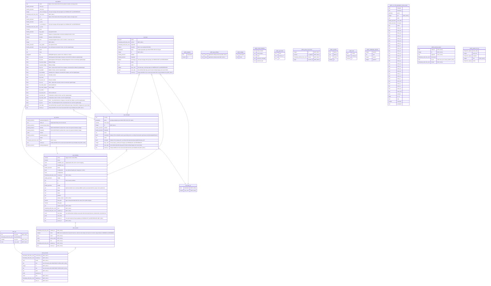

```mermaid
erDiagram
    api_logbook {
        text _from "Name of the location where the log started, usually a moorage name"
        double_precision _from_lat 
        double_precision _from_lng 
        integer _from_moorage_id "Link api.moorages with api.logbook via FOREIGN KEY and REFERENCES"
        timestamp_with_time_zone _from_time "{NOT_NULL}"
        text _to "Name of the location where the log ended, usually a moorage name"
        double_precision _to_lat 
        double_precision _to_lng 
        integer _to_moorage_id "Link api.moorages with api.logbook via FOREIGN KEY and REFERENCES"
        timestamp_with_time_zone _to_time 
        boolean active 
        double_precision avg_speed "avg speed in knots"
        numeric distance "Distance in Nautical Miles converted mobilitydb meters to NM"
        interval duration "Duration in ISO 8601 format"
        jsonb extra "Computed SignalK metrics such as runtime, current level, etc."
        integer id "{NOT_NULL}"
        double_precision max_speed "max speed in knots"
        double_precision max_wind_speed "true wind speed converted in knots, m/s from signalk plugin"
        text name 
        text notes 
        tgeogpoint trip "MobilityDB trajectory, speed in m/s, distance in meters"
        tfloat trip_awa "AWA (Apparent Wind Angle) in degrees converted from radians by signalk plugin"
        tfloat trip_aws "AWS (Apparent Wind Speed), windSpeedApparent in knots converted by signalk plugin"
        tfloat trip_batt_charge "Battery Charge"
        tfloat trip_batt_voltage "Battery Voltage"
        tfloat trip_cog "COG - Course Over Ground True in degrees converted from radians by signalk plugin"
        tfloat trip_depth "Depth in meters, raw from signalk plugin"
        tfloat trip_heading "Heading True in degrees converted from radians, raw from signalk plugin"
        tfloat trip_hum_out "Humidity outside"
        ttext trip_notes 
        tfloat trip_pres_out "Pressure outside"
        tfloat trip_sog "SOG - Speed Over Ground in knots converted by signalk plugin"
        tfloat trip_solar_power "solar powerPanel"
        tfloat trip_solar_voltage "solar voltage"
        ttext trip_status 
        tfloat trip_tank_level "Tank currentLevel"
        tfloat trip_temp_out "Temperature outside in Kelvin, raw from signalk plugin"
        tfloat trip_temp_water "Temperature water in Kelvin, raw from signalk plugin"
        tfloat trip_twd "TWD - True Wind Direction in degrees converted from radians, raw from signalk plugin"
        tfloat trip_tws "TWS - True Wind Speed in knots converted from m/s, raw from signalk plugin"
        jsonb user_data "User-defined data Log-specific data including actual tags, observations, images and custom fields"
        text vessel_id "Unique identifier for the vessel associated with the api.metadata entry {NOT_NULL}"
    }

    api_metadata {
        boolean active "trigger monitor online/offline"
        boolean active 
        jsonb available_keys "Signalk paths with unit for custom mapping"
        jsonb available_keys 
        double_precision beam 
        jsonb configuration "User-defined Signalk path mapping for metrics"
        jsonb configuration 
        timestamp_with_time_zone created_at "{NOT_NULL}"
        double_precision height 
        text ip "Store vessel ip address"
        text ip 
        double_precision length 
        text mmsi "Maritime Mobile Service Identity (MMSI) number associated with the vessel, link to public.mid"
        text mmsi 
        text name 
        text platform 
        text plugin_version "{NOT_NULL}"
        numeric ship_type "Type of ship associated with the vessel, link to public.aistypes"
        numeric ship_type 
        text signalk_version "{NOT_NULL}"
        timestamp_with_time_zone time "{NOT_NULL}"
        timestamp_with_time_zone updated_at "{NOT_NULL}"
        jsonb user_data "User-defined data including vessel polar (theoretical performance), make/model, and preferences"
        jsonb user_data 
        text vessel_id "Link auth.vessels with api.metadata via FOREIGN KEY and REFERENCES {NOT_NULL}"
        text vessel_id "{NOT_NULL}"
    }

    api_metrics {
        double_precision anglespeedapparent 
        text client_id "Deprecated client_id to be removed"
        double_precision courseovergroundtrue 
        double_precision latitude "With CONSTRAINT but allow NULL value to be ignored silently by trigger"
        double_precision longitude "With CONSTRAINT but allow NULL value to be ignored silently by trigger"
        jsonb metrics 
        double_precision speedoverground 
        text status 
        timestamp_with_time_zone time "{NOT_NULL}"
        text vessel_id "Unique identifier for the vessel associated with the api.metadata entry {NOT_NULL}"
        double_precision windspeedapparent 
    }

    api_moorages {
        text country 
        geography geog "postgis geography type default SRID 4326 Unit: degres"
        boolean home_flag 
        integer id "{NOT_NULL}"
        double_precision latitude 
        double_precision longitude 
        text name 
        jsonb nominatim "Output of the nominatim reverse geocoding service, see https://nominatim.org/release-docs/develop/api/Reverse/"
        text notes 
        jsonb overpass "Output of the overpass API, see https://wiki.openstreetmap.org/wiki/Overpass_API"
        integer stay_code "Link api.stays_at with api.moorages via FOREIGN KEY and REFERENCES"
        jsonb user_data "User-defined data Mooring-specific data including images and custom fields"
        text vessel_id "Unique identifier for the vessel associated with the api.metadata entry {NOT_NULL}"
    }

    api_stays {
        boolean active 
        timestamp_with_time_zone arrived "{NOT_NULL}"
        timestamp_with_time_zone departed 
        interval duration "Best to use standard ISO 8601"
        geography geog "postgis geography type default SRID 4326 Unit: degres"
        integer id "{NOT_NULL}"
        double_precision latitude 
        double_precision longitude 
        integer moorage_id "Link api.moorages with api.stays via FOREIGN KEY and REFERENCES"
        text name 
        text notes 
        integer stay_code "Link api.stays_at with api.stays via FOREIGN KEY and REFERENCES"
        jsonb user_data "User-defined data Stay-specific data including images and custom fields"
        text vessel_id "Unique identifier for the vessel associated with the api.metadata entry {NOT_NULL}"
    }

    api_stays_at {
        text description "{NOT_NULL}"
        integer stay_code "{NOT_NULL}"
    }

    auth_accounts {
        timestamp_with_time_zone connected_at "{NOT_NULL}"
        timestamp_with_time_zone created_at "{NOT_NULL}"
        citext email "{NOT_NULL}"
        text first "User first name with CONSTRAINT CHECK {NOT_NULL}"
        integer id "{NOT_NULL}"
        text last "User last name with CONSTRAINT CHECK {NOT_NULL}"
        text pass "{NOT_NULL}"
        jsonb preferences 
        name role "{NOT_NULL}"
        timestamp_with_time_zone updated_at "{NOT_NULL}"
        text user_id "{NOT_NULL}"
    }

    auth_otp {
        text otp_pass "{NOT_NULL}"
        timestamp_with_time_zone otp_timestamp 
        smallint otp_tries "{NOT_NULL}"
        citext user_email "{NOT_NULL}"
    }

    auth_vessels {
        timestamp_with_time_zone created_at "{NOT_NULL}"
        numeric mmsi "MMSI can be optional but if present must be a valid one and unique but must be in numeric range between 100000000 and 800000000"
        text name "{NOT_NULL}"
        citext owner_email "{NOT_NULL}"
        name role "{NOT_NULL}"
        timestamp_with_time_zone updated_at "{NOT_NULL}"
        text vessel_id "{NOT_NULL}"
    }

    public_aistypes {
        text description 
        numeric id 
    }

    public_app_settings {
        text name "application settings name key {NOT_NULL}"
        text value "application settings value {NOT_NULL}"
    }

    public_badges {
        text description 
        text name 
    }

    public_email_templates {
        text email_content 
        text email_subject 
        text name 
        text pushover_message 
        text pushover_title 
    }

    public_geocoders {
        text name 
        text reverse_url 
        text url 
    }

    public_goose_db_version {
        integer id "{NOT_NULL}"
        boolean is_applied "{NOT_NULL}"
        timestamp_without_time_zone tstamp "{NOT_NULL}"
        bigint version_id "{NOT_NULL}"
    }

    public_iso3166 {
        text alpha_2 
        text alpha_3 
        text country 
        integer id 
    }

    public_mid {
        text country 
        integer country_id 
        numeric id 
    }

    public_mobilitydb_opcache {
        integer ltypnum 
        oid opid 
        integer opnum 
        integer rtypnum 
    }

    public_ne_10m_geography_marine_polys {
        text changed 
        text featurecla 
        geometry geom 
        integer gid "{NOT_NULL}"
        text label 
        double_precision max_label 
        double_precision min_label 
        text name 
        text name_ar 
        text name_bn 
        text name_de 
        text name_el 
        text name_en 
        text name_es 
        text name_fa 
        text name_fr 
        text name_he 
        text name_hi 
        text name_hu 
        text name_id 
        text name_it 
        text name_ja 
        text name_ko 
        text name_nl 
        text name_pl 
        text name_pt 
        text name_ru 
        text name_sv 
        text name_tr 
        text name_uk 
        text name_ur 
        text name_vi 
        text name_zh 
        text name_zht 
        text namealt 
        bigint ne_id 
        text note 
        smallint scalerank 
        text wikidataid 
    }

    public_process_queue {
        text channel "{NOT_NULL}"
        integer id "{NOT_NULL}"
        text payload "{NOT_NULL}"
        timestamp_with_time_zone processed 
        text ref_id "either user_id or vessel_id {NOT_NULL}"
        timestamp_with_time_zone stored "{NOT_NULL}"
    }

    public_spatial_ref_sys {
        character_varying auth_name 
        integer auth_srid 
        character_varying proj4text 
        integer srid "{NOT_NULL}"
        character_varying srtext 
    }

    api_logbook }o--|| api_metadata : ""
    api_logbook }o--|| api_moorages : ""
    api_logbook }o--|| api_moorages : ""
    api_metadata |o--|| auth_vessels : ""
    api_metrics }o--|| api_metadata : ""
    api_moorages }o--|| api_metadata : ""
    api_stays }o--|| api_metadata : ""
    api_moorages }o--|| api_stays_at : ""
    api_stays }o--|| api_moorages : ""
    api_stays }o--|| api_stays_at : ""
    auth_otp |o--|| auth_accounts : ""
    auth_vessels }o--|| auth_accounts : ""
```