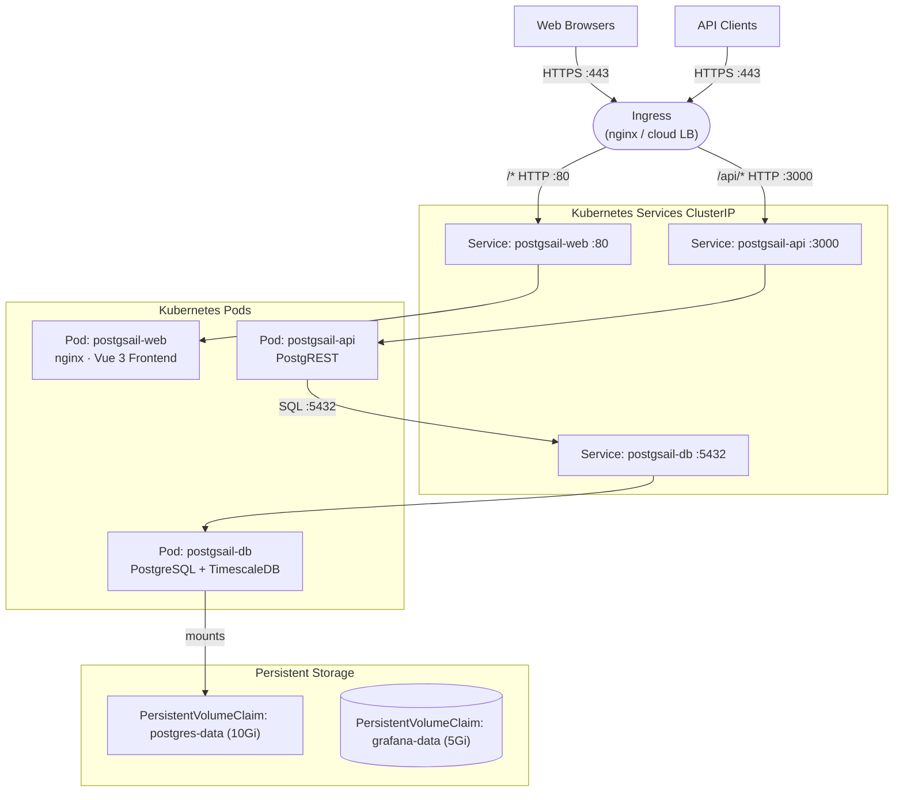

# Running with Kubernetes

A manifest for deploying PostgSail on Kubernetes is available in the [`kubernetes/`](https://github.com/xbgmsharp/postgsail/tree/main/kubernetes) directory of the repository. In addition to the application deployments, the manifest includes Services for connecting to each component and Persistent Volume Claims for retaining data between restarts.

## Prerequisites

- `kubectl` CLI installed and configured for a running cluster
- The repository cloned locally: `git clone https://github.com/xbgmsharp/postgsail`
- A configured `.env` file (copy `.env.example` and edit)

> [!NOTE]
> Most PostgSail images are **not available in a public registry** and must be built locally then imported into your cluster. Only `api` (PostgREST) and `app` (Grafana) use official upstream images.

### Building and importing images

Build all custom images:

```bash
docker compose build
```

Then import them into your cluster. For MicroK8s:

```bash
docker save xbgmsharp/postgsail-db:latest     | microk8s ctr images import -
docker save xbgmsharp/postgsail-migrate:latest | microk8s ctr images import -
docker save xbgmsharp/postgsail-web:latest     | microk8s ctr images import -
docker save xbgmsharp/postgsail-telegram-bot:latest | microk8s ctr images import -
```

For other clusters (e.g. kind):

```bash
kind load docker-image xbgmsharp/postgsail-db:latest
kind load docker-image xbgmsharp/postgsail-migrate:latest
kind load docker-image xbgmsharp/postgsail-web:latest
kind load docker-image xbgmsharp/postgsail-telegram-bot:latest
```

Verify the images are available:

```bash
microk8s ctr images ls | grep postgs
```

## Quick Start

**Create the namespace:**
```bash
kubectl create namespace postgsail --dry-run=client -o yaml | kubectl apply -f -
```

**Create secrets from your `.env` file:**
```bash
kubectl -n postgsail create secret generic postgsail-secrets \
  --from-env-file=.env \
  --dry-run=client -o yaml | kubectl apply -f -
```

**Apply the manifest:**
```bash
kubectl apply -f kubernetes/postgsail-deployment.yaml
```

> [!NOTE]
> The cluster must have a [Storage Class](https://kubernetes.io/docs/concepts/storage/storage-classes/) enabled, which many Kubernetes implementations do by default.
>
> If you find a pod stuck in a pending state, it may be due to no available storage class. See the [Settings and Data Storage](#settings-and-data-storage) section below.

## Reaching the Server

### Load Balancer

The deployment manifest includes a [Service](https://kubernetes.io/docs/concepts/services-networking/service/) resource for attachment to an [external load balancer](https://kubernetes.io/docs/tasks/access-application-cluster/create-external-load-balancer/). Once the cluster has a load balancer with an available IP address, your PostgSail instance becomes externally reachable. Find the assigned IP with:

```bash
kubectl describe service postgsail -n postgsail
```

It may take some time for your load balancer to assign addresses.

#### MicroK8s

An easy-to-configure load balancer is available in MicroK8s:

```bash
microk8s enable metallb
```

Specify a range of local IPs to dedicate to it (default ranges will often work).

### Ingress

For local or single-node clusters, an [Ingress](https://kubernetes.io/docs/concepts/services-networking/ingress/) resource is the simplest way to access the server without setting up a load balancer.

#### minikube

This command sets up a tunnel into the postgsail service and attempts to open it in a browser:

```bash
minikube service postgsail
```

Depending on how minikube is deployed, you may need to leave the resulting CLI process running to keep the tunnel available.

#### MicroK8s

Enable the nginx ingress controller (binds to host port 80):

```bash
microk8s enable ingress
```

Then deploy the ingress resource:

```bash
kubectl apply -f kubernetes/postgsail-ingress.yaml
```

The PostgSail web UI is then available at [http://localhost](http://localhost).

## Resource Architecture



## Settings and Data Storage

The deployment manifest uses [Persistent Volumes](https://kubernetes.io/docs/concepts/storage/persistent-volumes/) to retain data across restarts:

- `postgres-data` (10Gi) — PostgreSQL database
- `grafana-data` (5Gi) — Grafana dashboards and configuration

Many Kubernetes implementations include a default storage class. If not, pods will remain in a pending state.

#### MicroK8s

Enable the hostpath storage addon:

```bash
microk8s enable hostpath-storage
```

Then re-apply the deployment manifest.

## Checking Deployment Status

```bash
# List all pods
kubectl -n postgsail get pods

# Check migration job logs
kubectl -n postgsail logs job/migrate

# Check API logs
kubectl -n postgsail logs deployment/api

# List images (MicroK8s)
microk8s ctr images ls | grep postgs
```

## Uninstall

Remove all resources added to the cluster:

```bash
kubectl delete -f kubernetes/postgsail-deployment.yaml
```

#### MicroK8s

Disable ingress and storage addons if needed:

```bash
microk8s disable ingress
microk8s disable storage
```
